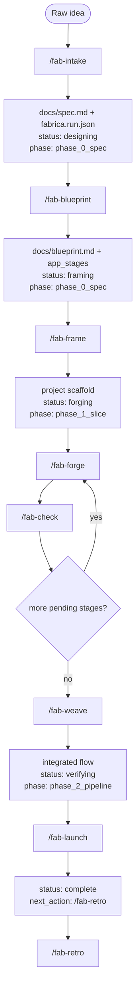

# fabrica run state machine

This document is the operator-facing state-machine reference for `fabrica.run.json` and the common command pathways through the skill pack.

Canonical implementation sources:

- Skill inventory, default gates, and dependencies: `skills/manifest.json`
- Run-state schema: `schemas/run-object.schema.json`
- Post-schema semantic checks: `scripts/validate-run.mjs`
- Human-readable field ownership: `skills/shared/run-object-schema.md`

## Core rule

`next_action` in `fabrica.run.json` is the source of truth. Follow it unless the operator intentionally overrides the workflow.

Every writer skill must:

1. read and validate the current run object;
2. build the full candidate run object;
3. validate the candidate;
4. write via same-directory temp file plus atomic rename;
5. leave the previous run object intact on validation or write failure.

## Main happy path



## Failure and recovery path


## Support commands


## Status values

| `status` | Meaning | Valid phases | Common setter |
|---|---|---|---|
| `designing` | Intake/spec work is in progress | `phase_0_spec` | `/fab-intake` |
| `framing` | Blueprint exists and scaffold is next | `phase_0_spec` | `/fab-blueprint` |
| `forging` | One or more app stages are being implemented | `phase_1_slice`, `phase_2_pipeline` | `/fab-frame`, `/fab-forge` |
| `checking` | Stage quality evaluation is in progress | `phase_1_slice`, `phase_2_pipeline` | `/fab-check` if used as an intermediate state |
| `weaving` | Integration work is in progress | `phase_2_pipeline` | `/fab-weave` if used as an intermediate state |
| `verifying` | Integrated prototype is ready for launch verification | `phase_2_pipeline` | `/fab-weave` |
| `complete` | Local launch verification passed | `phase_2_pipeline` | `/fab-launch` |
| `blocked` | Work cannot continue without diagnosis or decision | any phase | any writer skill |
| `abandoned` | Operator intentionally stopped the run | any phase | operator decision |

## Experiment phases

| Phase | Purpose | Typical commands |
|---|---|---|
| `phase_0_spec` | Convert idea into spec and blueprint | `/fab-intake`, `/fab-blueprint` |
| `phase_1_slice` | Build at least one vertical app slice | `/fab-frame`, `/fab-forge <stage>`, `/fab-check <stage>` |
| `phase_2_pipeline` | Integrate, verify, launch, and summarize | `/fab-weave`, `/fab-launch`, `/fab-signal`, `/fab-passport`, `/fab-retro` |

## Common command pathways

### New project, single-stage app

```text
/fab-intake
/fab-blueprint
/fab-frame
/fab-forge <stage>
/fab-check <stage>
/fab-weave
/fab-launch
/fab-retro
```

### New project, multi-stage app

```text
/fab-intake
/fab-blueprint
/fab-frame
/fab-forge <stage-1>
/fab-check <stage-1>
/fab-forge <stage-2>
/fab-check <stage-2>
...
/fab-weave
/fab-launch
/fab-retro
```

### Stage fails tests or quality gate

```text
/fab-forge <stage>
/fab-check <stage>
/fab-trace <stage>
/fab-check <stage>
```

If trace cannot resolve the issue:

```text
/fab-signal
```

### Integration fails

```text
/fab-weave
/fab-trace integration
/fab-weave
```

### Session handoff or status check

```text
/fab-pulse
/fab-passport
```

### Docker/container-capable prototype

When a blueprint requires Docker or Compose:

```text
/fab-blueprint   # defines local commands and container commands
/fab-frame       # scaffolds Dockerfiles/compose/static checks as first-class artifacts
/fab-forge <stage>
/fab-check <stage>
/fab-weave
/fab-launch      # records container_build if Docker runs, static_analysis if Docker is unavailable
```

If Docker is unavailable, `/fab-launch` must not claim runtime Docker verification. It must either keep the run non-complete with `last_error.type = "external_failure"`, or record an explicit `/fab-signal` human decision accepting static-only validation for the environment.

## Semantic validation enforced by `validate-run.mjs`

Beyond JSON Schema, the validator rejects:

- invalid `status × experiment_phase` combinations;
- duplicate `app_stages[].name` values;
- `current_app_stage` values not present in `app_stages`;
- lifecycle statuses such as `forging`, `checking`, `weaving`, `verifying`, or `complete` with no app stages;
- `complete` runs with any app stage not `done`;
- `next_action` commands for unknown skills;
- `/fab-forge <stage>` or `/fab-check <stage>` references to unknown stages;
- `/fab-trace <target>` references to unknown targets, except the special target `integration`.

## Gate summary

| Gate | Meaning |
|---|---|
| `auto` | Agent may proceed without pausing, while still validating state before writes. |
| `checkpoint` | Agent must show the plan or result before file mutation. |
| `review` | Local checks may run; external, destructive, or deploy actions need approval. |
| `full` | Agent needs approval before start and confirmation after completion. |
