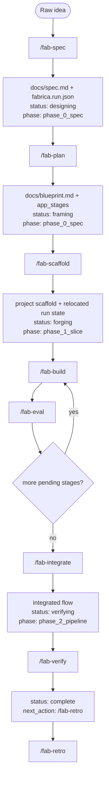
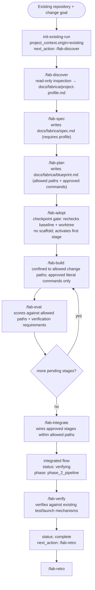
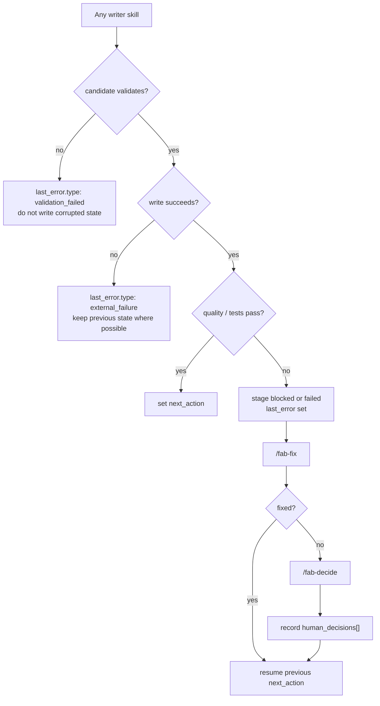
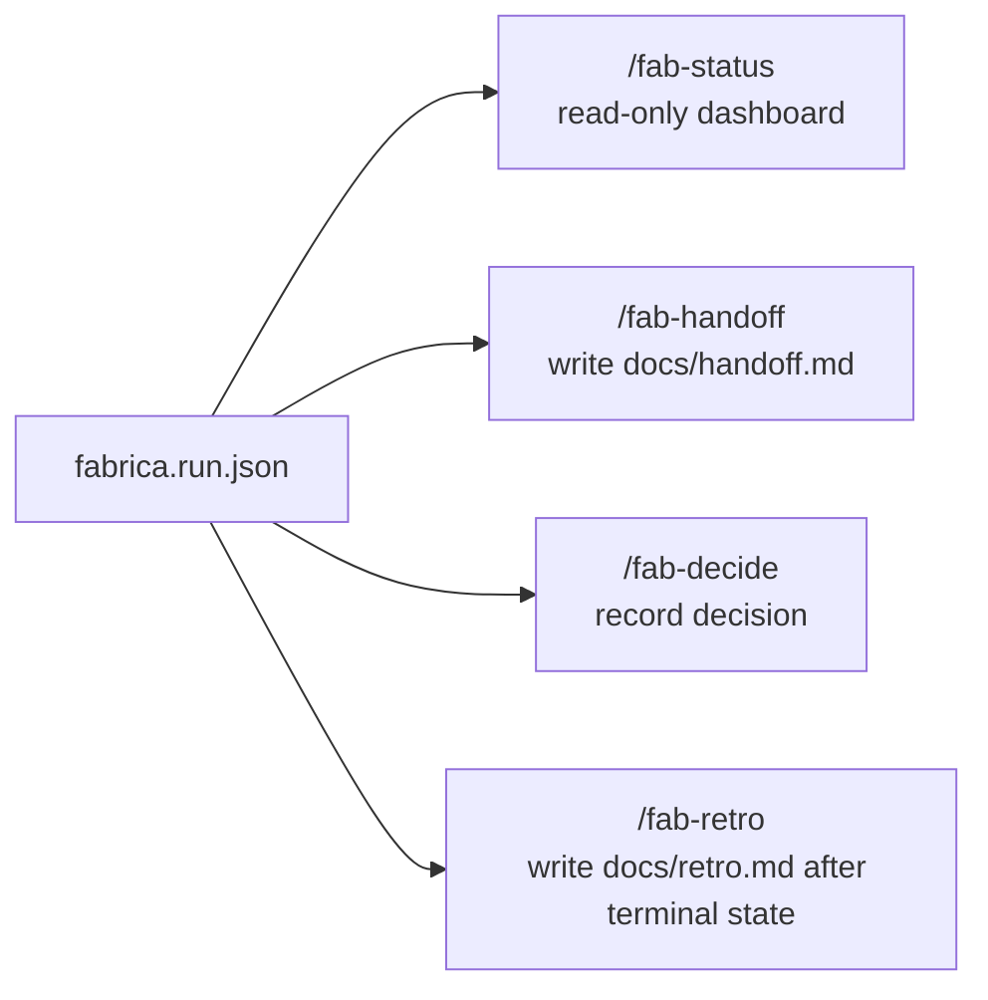

# fabrica run state machine

This document is the operator-facing state-machine reference for `fabrica.run.json` and the common command pathways through the skill pack.

Canonical implementation sources:

- Skill inventory, default gates, and dependencies: `skills/manifest.json`
- Run-state schema: `schemas/run-object.schema.json`
- Post-schema semantic checks: `scripts/validate-run.mjs`
- Gate-contract validators (executable skill guardrails): `scripts/_skill-gates.mjs`
- Human-readable field ownership: `skills/shared/run-object-schema.md`

## Core rule

`next_action` in `fabrica.run.json` is the source of truth. Follow it unless the operator intentionally overrides the workflow.

Every writer skill must:

1. read and validate the current run object;
2. build the full candidate run object;
3. validate the candidate;
4. write via same-directory temp file plus atomic rename;
5. leave the previous run object intact on validation or write failure.

## Main happy path

### New project (greenfield)



### Existing project (opt-in via `init-existing-run`)



`next_action` remains the source of truth in both workflows. New-project runs never set `project_context`; existing-project runs carry it from `init-existing-run` onward (`project_root`, `profile_path`, `baseline`). `fab-scaffold` refuses existing-project runs and routes to `/fab-adopt`.

## Failure and recovery path



## Support commands



## Status values

| `status`    | Meaning                                               | Valid phases                        | Common setter                                        |
| ----------- | ----------------------------------------------------- | ----------------------------------- | ---------------------------------------------------- |
| `designing` | Intake/spec work is in progress                       | `phase_0_spec`                      | `/fab-spec`                                          |
| `framing`   | Blueprint exists and scaffold is next                 | `phase_0_spec`                      | `/fab-plan`                                          |
| `forging`   | One or more app stages are being implemented          | `phase_1_slice`, `phase_2_pipeline` | `/fab-scaffold`                                      |
| `checking`  | Stage quality evaluation is in progress               | `phase_1_slice`, `phase_2_pipeline` | none (valid but unused; no skill writes this status) |
| `weaving`   | Integration work is in progress                       | `phase_2_pipeline`                  | none (valid but unused; no skill writes this status) |
| `verifying` | Integrated prototype is ready for launch verification | `phase_2_pipeline`                  | `/fab-integrate`                                     |
| `complete`  | Local launch verification passed                      | `phase_2_pipeline`                  | `/fab-verify`                                        |
| `blocked`   | Work cannot continue without diagnosis or decision    | any phase                           | any writer skill                                     |
| `abandoned` | Operator intentionally stopped the run                | any phase                           | operator decision                                    |

## Experiment phases

| Phase              | Purpose                                  | Typical commands                                                             |
| ------------------ | ---------------------------------------- | ---------------------------------------------------------------------------- |
| `phase_0_spec`     | Convert idea into spec and blueprint     | `/fab-spec`, `/fab-plan`                                                     |
| `phase_1_slice`    | Build at least one vertical app slice    | `/fab-scaffold`, `/fab-build <stage>`, `/fab-eval <stage>`                   |
| `phase_2_pipeline` | Integrate, verify, launch, and summarize | `/fab-integrate`, `/fab-verify`, `/fab-decide`, `/fab-handoff`, `/fab-retro` |

## Common command pathways

### New project, single-stage app

```text
/fab-spec
/fab-plan
/fab-scaffold
/fab-build <stage>
/fab-eval <stage>
/fab-integrate
/fab-verify
/fab-retro
```

### Existing project — change workflow

Opt-in is explicit: `init-existing-run` creates run state with `project_context` (origin, project root, profile path, Git baseline). No application source is inspected or modified at init time.

```text
init-existing-run [--root .] [--profile docs/fabrica/project-profile.md]
/fab-discover          # read-only inspection → docs/fabrica/project-profile.md (next_action: /fab-spec)
/fab-spec              # writes docs/fabrica/spec.md (requires profile)
/fab-plan              # writes docs/fabrica/blueprint.md (allowed change paths + approved literal commands)
/fab-adopt             # checkpoint gate: rechecks baseline + worktree; no scaffold; activates first stage
/fab-build <stage>     # confined to allowed change paths; approved literal commands only; rechecks baseline before writes
/fab-eval <stage>      # scores against allowed paths + verification requirements
/fab-integrate         # wires approved stages within allowed paths
/fab-verify            # verifies against existing test/launch mechanisms
/fab-retro
```

Rules for existing-project mode:

- `/fab-scaffold` refuses existing-project runs with `prerequisite_missing` and routes to `/fab-adopt`.
- `project_context` is set once at init and never modified by skills; `spec_path`/`blueprint_path` use `docs/fabrica/` for this mode.
- Before any writer operation, the skill rechecks `project_root`, `baseline` (HEAD/branch/worktree), and allowed paths; it halts on drift or on a dirty worktree without a recorded human decision.
- Every write stays inside the approved stage paths; every command is a literal approved by the blueprint.

### Generic multi-service pathway

```text
/fab-spec
/fab-plan   # must define service plan
/fab-scaffold       # creates one directory per service and relocates run state
/fab-build <stage>
/fab-eval <stage>
...
/fab-integrate
/fab-verify
/fab-retro
```

The service plan, not the skill name, determines whether the generated app uses React, FastAPI, SQLite, Docker, Go, Rust, Java, Rails, Svelte, Postgres, Redis, or any other stack.

### New project, multi-stage app

```text
/fab-spec
/fab-plan
/fab-scaffold
/fab-build <stage-1>
/fab-eval <stage-1>
/fab-build <stage-2>
/fab-eval <stage-2>
...
/fab-integrate
/fab-verify
/fab-retro
```

### Stage fails tests or quality gate

```text
/fab-build <stage>
/fab-eval <stage>
/fab-fix <stage>
/fab-eval <stage>
```

If trace cannot resolve the issue:

```text
/fab-decide
```

### Integration fails

```text
/fab-integrate
/fab-fix integration
/fab-integrate
```

### Session handoff or status check

```text
/fab-status
/fab-handoff
```

### Containerized or multi-service prototype

When a blueprint declares multiple services, containers, or Docker Compose:

```text
/fab-plan   # defines service plan, local commands, container commands, ports, env vars, data paths
/fab-scaffold       # scaffolds per-service directories, manifests, config boundaries, Dockerfiles/Compose if required
/fab-build <stage>
/fab-eval <stage>
/fab-integrate
/fab-verify      # records container_build only if Docker actually runs; otherwise static_analysis plus explicit caveat
```

Rules:

- Do not assume a specific stack. React, FastAPI, SQLite, Docker, Go, Rust, Java, Rails, Svelte, Postgres, Redis, and CLI-only apps must all be blueprint-derived cases.
- `container_build` means an actual container build or runtime check ran.
- `static_analysis` means files were checked without running the container runtime.
- If Docker is unavailable, `/fab-verify` must not claim Docker runtime verification. It must either keep the run non-complete with `external_failure`, or record an explicit `/fab-decide` decision accepting static-only validation in that environment.

The state machine is stack-agnostic. It does not know whether a stage is Python, Node, Go, Rust, Java, a CLI, a web app, or a containerized multi-service system. Technology-specific evidence belongs in `verifications[]`, not in status names.

## Semantic validation

### Post-schema checks in `validate-run.mjs`

Beyond JSON Schema, the validator rejects:

- invalid `status × experiment_phase` combinations;
- duplicate `app_stages[].name` values;
- `current_app_stage` values not present in `app_stages`;
- lifecycle statuses such as `forging`, `checking`, `weaving`, `verifying`, or `complete` with no app stages;
- `complete` runs with any app stage not `done`;
- `next_action` commands for unknown skills;
- `/fab-build <stage>` or `/fab-eval <stage>` references to unknown stages;
- `/fab-fix <target>` references to unknown targets, except the special target `integration`.

### Gate-contract validators in `_skill-gates.mjs`

`scripts/_skill-gates.mjs` implements executable gate contracts derived from each `SKILL.md`'s **Execution Guardrails** and **Behavior** sections. It is imported and called by `validate-run.mjs` via `validateAllGates()`:

| Validator                    | What it enforces                                                                                                                                   |
| ---------------------------- | -------------------------------------------------------------------------------------------------------------------------------------------------- |
| `validateFabLaunchGate`      | `external_deploy` kind requires prior human approval; `container_build` must invoke Docker; `complete` status requires a launch verification entry |
| `validateFabSignalGate`      | Every non-null decision must have a `resolved_at` timestamp: no auto-populated decisions                                                           |
| `validateFabCheckGate`       | Stage with `quality_score < 6` must not be `done`                                                                                                  |
| `validateFabPulseGate`       | When `costs.precision` is `unknown`, all numeric cost fields must also be `unknown`                                                                |
| `validateNextActionGate`     | `fab-integrate` requires all `app_stages` done; `fab-verify` requires `status === "verifying"`                                                     |
| `validateTimestampOrderGate` | `human_decisions[].resolved_at` must not be earlier than `triggered_at`                                                                            |
| `validateCostPrecisionGate`  | `costs.precision` must be one of: `unknown`, `estimated`, `measured`                                                                               |

## Gate summary

| Gate         | Meaning                                                                        |
| ------------ | ------------------------------------------------------------------------------ |
| `auto`       | Agent may proceed without pausing, while still validating state before writes. |
| `checkpoint` | Agent must show the plan or result before file mutation.                       |

Checkpoint is a hard turn boundary: at a checkpoint gate the agent ends its turn after the questions or after the approval prompt — it never continues into writes in the same turn. Approval is bound to the artifact (`approve spec`, `approve blueprint`); a bare `yes`, questions, edits, or silence approve nothing and change nothing. `--auto` (or `gate_levels` already `auto`) is the only bypass, and only for overridable checkpoints.
| `review`     | Local checks may run; external, destructive, or deploy actions need approval.  |
| `full`       | Agent needs approval before start and confirmation after completion.           |
